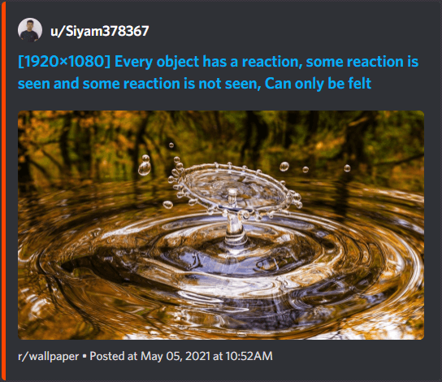

# Reddit

Tip:

> To filter out text posts it's recommended to use `New post from search` trigger and `subreddit:XYZ self:no` query, where `XYZ` is subreddit name.

## Reddit embed

```json
{
  "content": "{{PostURL}}"
}
```


## Embed with text

Image preview won't be shown and if content has more than 2048 characters, request will fail.

```json
{
  "embeds": [{
    "color": 16729344,
    "author": {
      "name": "u/{{Author}}",
      "url": "https://www.reddit.com/user/{{Author}}",
      "icon_url": "https://avatar-resolver.vercel.app/reddit/{{Author}}"
    },
    "title": "<<<{{Title}}>>>",
    "url": "{{PostURL}}",
    "description": "<<<{{Content}}>>>",
    "footer": { "text": "r/{{Subreddit}} • Posted at {{PostedAt}}" }
  }]
}
```


## Embed with image

`"file not found"` placeholder will be shown on text posts.

```json
{
  "embeds": [{
    "color": 16729344,
    "author": {
      "name": "u/{{Author}}",
      "url": "https://www.reddit.com/user/{{Author}}",
      "icon_url": "https://avatar-resolver.vercel.app/reddit/{{Author}}"
    },
    "title": "<<<{{Title}}>>>",
    "url": "{{PostURL}}",
    "image": { "url": "{{ImageURL}}" },
    "footer": { "text": "r/{{Subreddit}} • Posted at {{PostedAt}}" }
  }]
}
```



## Link embed

Best with link post which are video or GIFs. `"allowed_mentions"` will disable everyone/here mentions in content if there any, user/role mentions will still work if you wish to add any. big text posts (over 1k characters).

```json
{
  "content": "New Post in **r/{{Subreddit}}** by **u/{{Author}}**\n**<<<{{Title}}>>>**\n<<<{{Content}}>>>",
  "allowed_mentions": { "parse": ["users", "roles"] }
}
```


## Filter code

Adds text to embed for text posts and image for link ones, shortens content so it doesn't break the body

```ts
const body: any = {
  embeds: [{
    color: 0xFF4500,
    author: {
      name: `u/${Trigger.Author}`,
      url: `https://www.reddit.com/user/${Trigger.Author}`,
      icon_url: `https://avatar-resolver.vercel.app/reddit/${Trigger.Author}`
    },
    title: Trigger.Title,
    url: Trigger.PostURL,
    footer: { text: `r/${Trigger.Subreddit}` },
    timestamp: Meta.triggerTime // returns null | use .currentUserTime for now
  }]
};
if (/^http\S+$/.test(Trigger.Content)) {
  body.embeds[0].image = { url: Trigger.ImageURL };
} else {
  body.embeds[0].description = Trigger.Content.slice(0, 2048);
}
MakerWebhooks.makeWebRequest.setBody(JSON.stringify(body));
```


