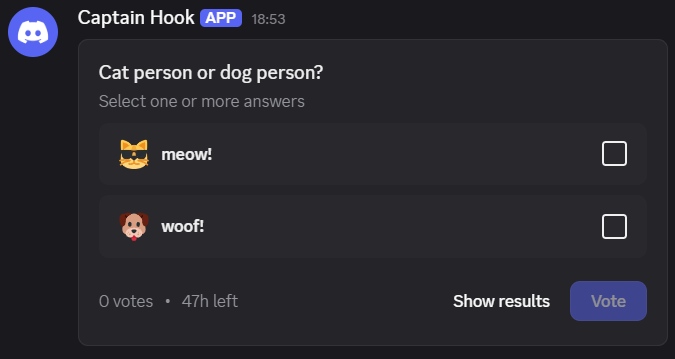

# poll

Allows to add poll to message. Poll always has a question (up to 300 characters) with at least 1 answer (up to 10 options total, up to 55 characters per each). Poll duration can be set to value between 1 and 768 hours (32 days), if omitted 24 hours are assumed. Additionally, multiple answers mode is available, but there's no way to limit how many can be selected at time when it's enabled.

Structure can be a bit confusing at first, let's break it down:

* `poll` - poll object
  * `question` - poll question object
    * `text` - poll question text value, up to 300 characters
  * `answers` - array of poll answer objects, up to 10 options can be specified, at least 1 is required
    * `poll_media` - poll answer object
      * `text` - poll answer text
      * `emoji` - emoji object, optional
        * `id` - id of emoji, should be provided as string, used when emoji is custom
        * `name` - name of emoji, should be written as Unicode character, used when emoji is built-in
  * `duration` - duration of the poll in hours (1-768), default is 24 hours
  * `allow_multiselect` - if true, allows to select multiple answers, optional, default is false

Example:

```json
{
  "poll": {
    "question": {
      "text": "Cat person or dog person?"
    },
    "answers": [
      {
        "poll_media": {
          "text": "meow!",
          "emoji": {
            "id": "1365720705324421202"
          }
        }
      },
      {
        "poll_media": {
          "text": "woof!",
          "emoji": {
            "name": "🐶"
          }
        }
      }
    ],
    "allow_multiselect": true,
    "duration": 48
  }
}
```



## Additional information

By adding `wait=true` to the request query, you can get a response with the message structure, that will include all kind of data about message, including Message ID. Later on it can be used to get poll results using [Get Webhook Message](https://discord.com/developers/docs/resources/webhook#get-webhook-message) request, it allows to see number of votes, but not voters. Additionally there's no way to close poll as it's possible for users and bots (both can only close own polls only).

[Discord API reference](https://discord.com/developers/docs/resources/poll#poll-create-request-object)
