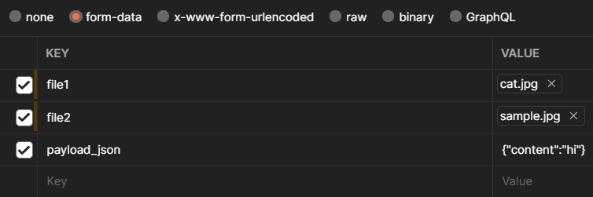

# Postman

[Postman](https://www.postman.com/downloads/) is a GUI tool for sending web requests.

Download it from official website. Available for Windows, Linux, and macOS.

Here's how to use it:

1. Click `+` on the tabs panel.
2. Click on dropdown in front of URL field and choose `POST`.
3. Paste Webhook URL in URL field.
4. Click `Body` tab > `raw` > `JSON` from the dropdown.
5. Paste the body below.
6. Press `Send`.
7. If status shows `204 No Content` means request succeed!

## Sending attachments

To send attachment(s):

1. Switch from `raw` to `form-data`.
2. Hover on key field, click on dropdown and choose `File`.
3. Click `Select Files` and select file (despite it allowing you to choose multiple files, choose one).
4. Repeat if you want to add more attachments.
5. To add json to request add key with `payload_json` name and json body value (dropdown must say `Text`).

